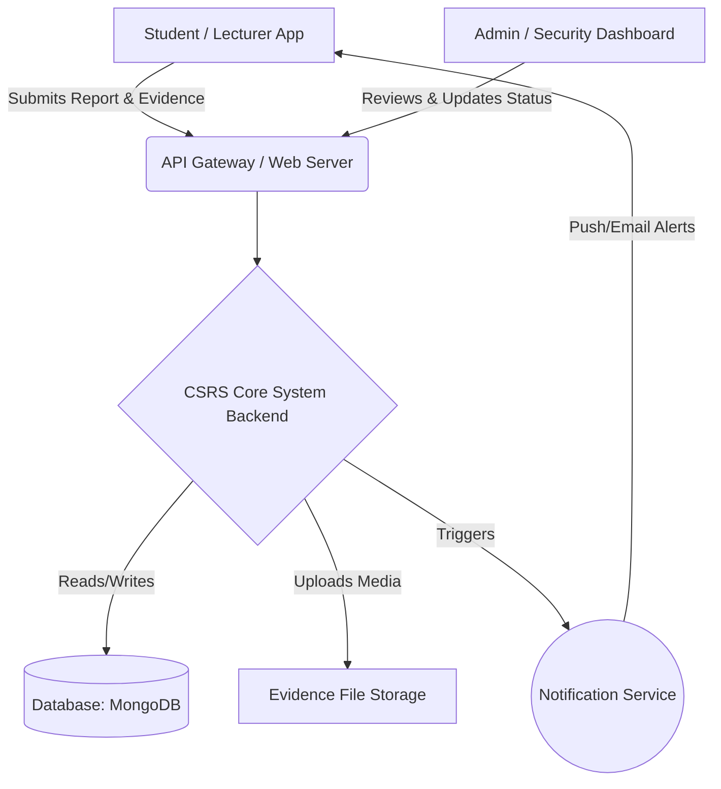
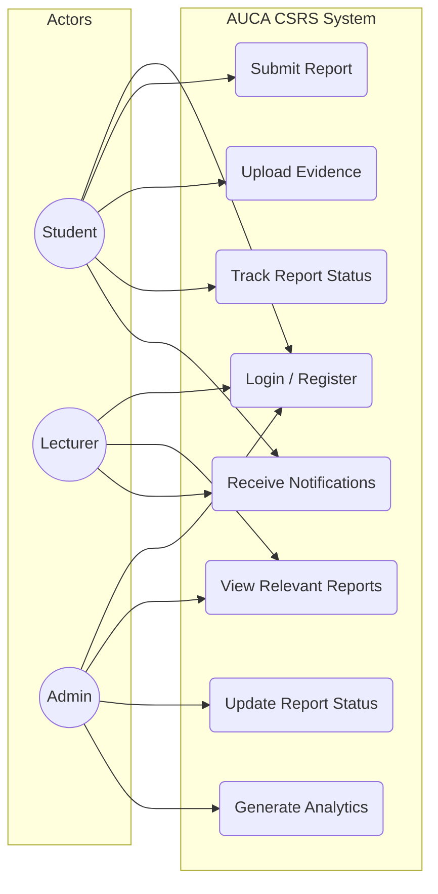
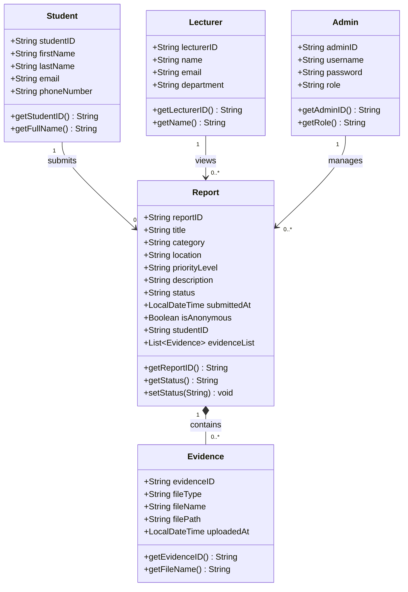
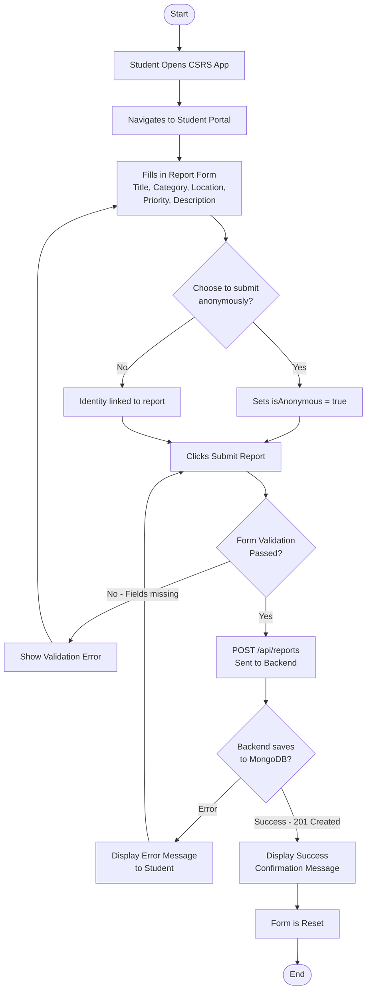
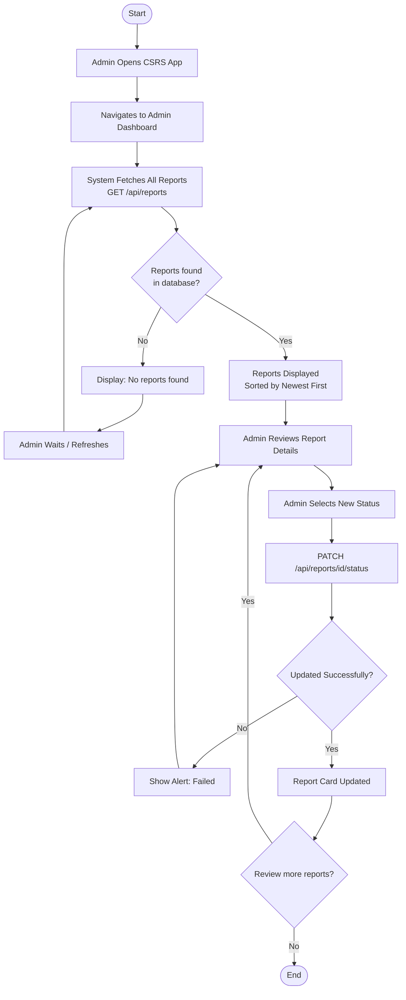
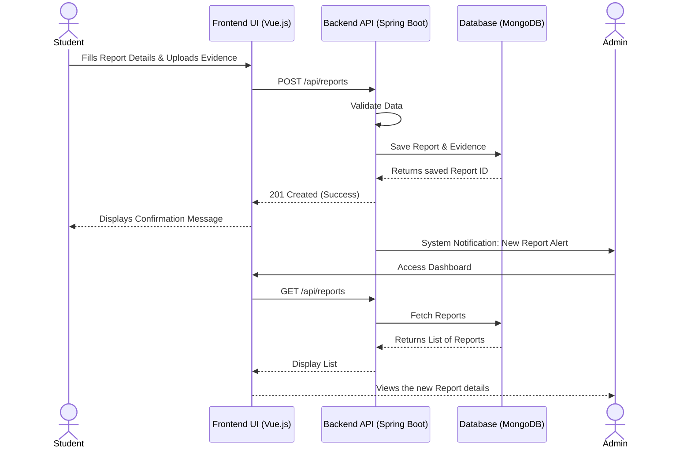
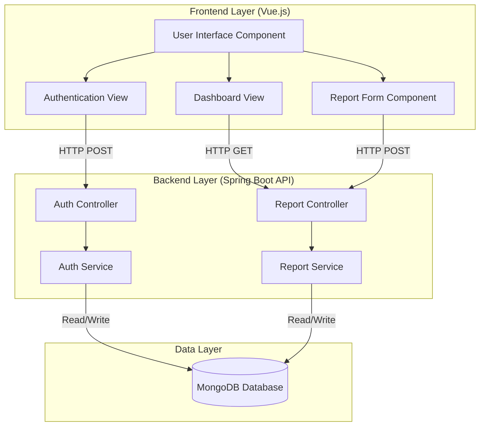

# AUCA Campus Security And Reporting System (CSRS)
## Final Project Submission Document

---

| | |
|---|---|
| **Course** | Best Programming Practices and Design Patterns |
| **Instructor** | RUTARINDWA JEAN PIERRE |
| **Institution** | Adventist University of Central Africa (AUCA) |
| **Topic** | Campus Security And Reporting System |
| **Case Study** | Adventist University of Central Africa (AUCA) |
| **Live Application** | https://campus-security-and-reporting-syste.vercel.app |
| **Source Code** | https://github.com/uw-Adeline/Campus-Security-And-Reporting-System- |
| **Backend API** | https://campus-security-and-reporting-system.onrender.com/api/reports |
| **API Documentation** | https://campus-security-and-reporting-system.onrender.com/swagger-ui.html |

---

## Table of Contents

1. [Phase 1 — System Analysis and Design](#phase-1)
2. [Phase 2 — Software Development Prototype](#phase-2)
3. [Phase 3 — Docker and Version Control](#phase-3)
4. [Phase 4 — Software Test Plan](#phase-4)

---

<a name="phase-1"></a>
# PHASE 1: System Analysis and Design

## i. General Description and Analysis of the Case Study

**Adventist University of Central Africa (AUCA)** is a prominent higher education institution located in Rwanda. The campus hosts a large number of students, faculty, and administrative staff who move daily across its premises. Maintaining a safe and secure environment is a top priority for the institution.

Currently, security management relies heavily on manual patrols, physical security guards stationed at key points, and traditional reporting methods such as phone calls or physical visits to the security office. While functional, this traditional approach lacks a centralized, real-time digital mechanism for the university community to interact with the security department.

The **Campus Security And Reporting System (CSRS)** was proposed to solve this problem by providing a digital platform where students and staff can report security incidents quickly, anonymously if needed, and track the status of their reports in real time.

---

## ii. Functional Diagram

This diagram illustrates the internal workings and data flow of the CSRS within the AUCA environment.



---

## iii. Problems Faced by AUCA

Despite having a dedicated security team, AUCA faces several critical challenges:

1. **Delayed Incident Reporting & Response** — Students and staff must physically locate a guard or call an office to report an issue, leading to dangerous delays during critical incidents.

2. **Lack of Anonymity** — Fear of retaliation or exposure often discourages students from reporting suspicious activities, vandalism, or bullying.

3. **Loss of Critical Evidence** — In a manual system, physical evidence such as photos or videos is difficult to formally attach to an incident report and is often lost or mishandled.

4. **No Centralized Tracking & Analytics** — The administration has no automated way to track the status of reported incidents in real-time, nor can they easily generate analytical reports to identify recurring security threats on campus.

---

## iv. Object-Oriented System Analysis and Design Diagrams

### 1. Use Case Diagram



### 2. Class Diagram



### 3. Activity Diagrams

**Activity Diagram 1 — Student Submits a Security Report**



**Activity Diagram 2 — Admin Reviews and Updates a Report**



### 4. Sequence Diagram



### 5. Component Diagram



---

<a name="phase-2"></a>
# PHASE 2: Software Development Prototype

## Technology Stack

| Layer | Technology | Version |
|-------|-----------|---------|
| Backend Framework | Spring Boot | 3.2.5 |
| Frontend Framework | Vue.js | 3.x |
| Database | MongoDB Atlas | Cloud |
| Build Tool | Maven | 3.9.6 |
| HTTP Client | Axios | 1.x |
| API Documentation | Swagger / OpenAPI | 2.5.0 |
| Java Version | Java | 17 |

## Design Pattern Applied: Service Layer Pattern

The **Service Layer Pattern** organizes application logic into 3 distinct layers:

```
┌─────────────────────────────────────┐
│   Controller Layer (ReportController)│  ← Handles HTTP requests/responses only
├─────────────────────────────────────┤
│   Service Layer (ReportService)      │  ← Contains all business logic
├─────────────────────────────────────┤
│   Repository Layer (ReportRepository)│  ← Handles database operations only
└─────────────────────────────────────┘
```

**Why this pattern?**
- Each layer has one clear responsibility
- Business logic is reusable and testable independently
- Changing the database only affects the Repository layer
- Changing business rules only affects the Service layer

**Example — Status Validation in Service Layer:**
```java
public Optional<Report> updateReportStatus(String reportId, String newStatus) {
    // Business logic: validate status before touching the database
    if (!isValidStatus(newStatus)) {
        throw new IllegalArgumentException("Invalid status: " + newStatus);
    }
    // Only reaches database if validation passes
    Optional<Report> reportData = reportRepository.findById(reportId);
    ...
}
```

## Google Java Style Guide & Spring Boot Best Practices Followed

| Standard | How Applied |
|----------|------------|
| PascalCase for classes | `ReportService`, `ReportController`, `ReportRepository` |
| camelCase for methods | `createReport()`, `updateReportStatus()`, `getAllReports()` |
| Constructor injection | All dependencies injected via constructor, not field injection |
| Javadoc comments | All public methods documented with `@param` and `@return` |
| Bean Validation | `@NotBlank`, `@Email` annotations on model fields |
| RESTful URL design | Resource-based URLs: `/api/reports` not `/api/getReports` |
| Correct HTTP status codes | `201 Created`, `200 OK`, `404 Not Found`, `400 Bad Request` |

## API Endpoints

| Method | Endpoint | Description | Response |
|--------|----------|-------------|----------|
| POST | `/api/reports` | Create a new report | 201 Created |
| GET | `/api/reports` | Get all reports | 200 OK |
| GET | `/api/reports/{id}` | Get report by ID | 200 OK / 404 |
| PATCH | `/api/reports/{id}/status` | Update report status | 200 OK / 404 |
| DELETE | `/api/reports/{id}` | Delete a report | 204 No Content |

## Project Structure

```
csrs-backend/
├── controller/ReportController.java   ← HTTP layer only
├── service/ReportService.java         ← Business logic
├── repository/ReportRepository.java   ← Database access
└── model/
    ├── Report.java
    ├── Evidence.java
    ├── Student.java
    ├── Lecturer.java
    └── Admin.java

csrs-frontend/
└── src/components/
    ├── ReportForm.vue                 ← Student portal
    └── AdminDashboard.vue             ← Admin panel
```

---

<a name="phase-3"></a>
# PHASE 3: Docker and Version Control

## Part A: Docker

### What is Docker?
Docker is a platform for **containerization** — packaging an application and all its dependencies into a single portable unit called a **container**. A container runs identically on any machine regardless of the operating system or installed software.

### Why Docker for CSRS?
Without Docker, running CSRS requires manually installing Java 17, Node.js, and MongoDB on every machine. With Docker, one command starts everything:
```bash
docker-compose up --build
```

### Multi-Stage Build Strategy

Both Dockerfiles use **multi-stage builds** to keep images small:

**Backend (csrs-backend/Dockerfile):**
```
Stage 1 (Build):  maven:3.9.6 → compiles Java code → produces .jar file
Stage 2 (Run):    eclipse-temurin:17-jre-alpine → runs the .jar (200MB vs 600MB)
```

**Frontend (csrs-frontend/Dockerfile):**
```
Stage 1 (Build):  node:20-alpine → runs npm run build → produces /dist folder
Stage 2 (Serve):  nginx:stable-alpine → serves static files + proxies API calls
```

### docker-compose.yml — Orchestration

The `docker-compose.yml` file starts all 3 services together:

```yaml
services:
  mongodb:   # Database container
  backend:   # Spring Boot API container (depends on mongodb)
  frontend:  # Vue.js + Nginx container (depends on backend)
```

**Key features:**
- `depends_on` — ensures correct startup order
- `networks` — all containers share `csrs-network` and communicate by service name
- `volumes` — `mongodb_data` persists database between restarts

### Architecture After Dockerization

```
User Browser → http://localhost (port 80)
                    ↓
              Nginx (Frontend Container)
                    ↓ /api/* requests
              Spring Boot (Backend Container, port 8080)
                    ↓
              MongoDB (Database Container, port 27017)
```

### How to Run with Docker
```bash
docker-compose up --build
# Frontend:  http://localhost
# Backend:   http://localhost:8080
# Swagger:   http://localhost:8080/swagger-ui.html
```

---

## Part B: Version Control with Git

### What is Git?
Git is the world's most widely used **Version Control System (VCS)**. It tracks every change made to code, who made it, and when — allowing developers to collaborate, revert mistakes, and maintain a full history of the project.

### Git Setup for CSRS

```bash
# Initialize repository
git init

# Configure identity
git config user.name "AUCA Student"
git config user.email "student@auca.ac.rw"

# Stage all files (respects .gitignore)
git add .

# Create first commit
git commit -m "Phase 1: System analysis and design"

# Connect to GitHub
git remote add origin https://github.com/uw-Adeline/Campus-Security-And-Reporting-System-.git

# Push to GitHub
git push -u origin master
```

### Commit History

```
419913a  Update deployment config with correct repository name
ed5bbf8  Phase 3: Configure deployment for Render and Vercel
f0a37c2  Phase 4: Add test plan, JUnit unit tests, and MockMvc integration tests
c702ef0  Phase 1: System analysis and design - all 5 UML diagrams
```

### .gitignore — What We Exclude and Why

| Excluded | Reason |
|----------|--------|
| `csrs-backend/target/` | Compiled Java bytecode — auto-generated by Maven |
| `csrs-frontend/node_modules/` | 300MB+ npm packages — reinstalled with `npm install` |
| `.env` | Passwords and secrets — never commit to version control |
| `*.log` | Log files — change constantly, not useful in history |
| `.idea/` `.vscode/` | IDE settings — different per developer |

### Deployment

| Service | Platform | URL |
|---------|----------|-----|
| Frontend | Vercel (free) | https://campus-security-and-reporting-syste.vercel.app |
| Backend | Render (free) | https://campus-security-and-reporting-system.onrender.com |
| Database | MongoDB Atlas (free) | Cloud hosted |
| Source Code | GitHub (free) | https://github.com/uw-Adeline/Campus-Security-And-Reporting-System- |

---

<a name="phase-4"></a>
# PHASE 4: Software Test Plan

## 1. Introduction

This test plan verifies that the CSRS application meets all functional requirements defined in Phase 1 and implemented in Phase 2. Testing covers the Backend Service Layer, REST API Controller Layer, and Frontend UI.

## 2. Test Types Used

| Type | Tool | What It Tests |
|------|------|---------------|
| Unit Testing | JUnit 5 + Mockito | Service Layer business logic in isolation |
| Integration Testing | Spring MockMvc | REST API endpoints (HTTP layer) |
| Manual Testing | Browser | Frontend UI behavior |

## 3. Testing Approach — AAA Pattern

Every automated test follows the **Arrange → Act → Assert** pattern:
```java
@Test
void createReport_ValidReport_ReturnsSavedReport() {
    // ARRANGE — set up test data and mocks
    when(reportRepository.save(any())).thenReturn(sampleReport);

    // ACT — call the method being tested
    Report result = reportService.createReport(sampleReport);

    // ASSERT — verify the result
    assertNotNull(result);
    assertEquals("PENDING", result.getStatus());
    verify(reportRepository, times(1)).save(sampleReport);
}
```

## 4. What is Mockito?

Mockito creates **fake (mock) versions** of dependencies so tests run without a real database:
```java
@Mock
private ReportRepository reportRepository; // Fake — no MongoDB needed

// Tell the fake what to return
when(reportRepository.findAll()).thenReturn(Arrays.asList(report1, report2));
```

This makes tests:
- **Fast** — no database connection needed
- **Reliable** — not affected by network or database issues
- **Isolated** — tests only the code we wrote, not external systems

## 5. Test Results Summary

### Service Layer Tests (ReportServiceTest.java) — 12 Tests

| Test ID | Test Description | Result |
|---------|-----------------|--------|
| TC-SRV-001 | Create valid report returns PENDING status | ✅ PASS |
| TC-SRV-002 | Null status defaults to PENDING | ✅ PASS |
| TC-SRV-003 | Get all reports returns full list | ✅ PASS |
| TC-SRV-004 | Get all reports returns empty list | ✅ PASS |
| TC-SRV-005 | Get report by existing ID returns report | ✅ PASS |
| TC-SRV-006 | Get report by non-existing ID returns empty | ✅ PASS |
| TC-SRV-007 | Update status to IN_PROGRESS succeeds | ✅ PASS |
| TC-SRV-008 | Update status to RESOLVED succeeds | ✅ PASS |
| TC-SRV-009 | Invalid status throws IllegalArgumentException | ✅ PASS |
| TC-SRV-010 | Update status on non-existing report returns empty | ✅ PASS |
| TC-SRV-011 | Delete existing report returns true | ✅ PASS |
| TC-SRV-012 | Delete non-existing report returns false | ✅ PASS |

### Controller Layer Tests (ReportControllerTest.java) — 11 Tests

| Test ID | Endpoint Tested | Expected | Result |
|---------|----------------|----------|--------|
| TC-CTRL-001 | POST /api/reports (valid) | 201 Created | ✅ PASS |
| TC-CTRL-002 | POST /api/reports (missing title) | 400 Bad Request | ✅ PASS |
| TC-CTRL-003 | GET /api/reports (has data) | 200 OK + list | ✅ PASS |
| TC-CTRL-004 | GET /api/reports (empty) | 200 OK + [] | ✅ PASS |
| TC-CTRL-005 | GET /api/reports/{id} (found) | 200 OK | ✅ PASS |
| TC-CTRL-006 | GET /api/reports/{id} (not found) | 404 Not Found | ✅ PASS |
| TC-CTRL-007 | PATCH status (valid) | 200 OK | ✅ PASS |
| TC-CTRL-008 | PATCH status (invalid value) | 400 Bad Request | ✅ PASS |
| TC-CTRL-009 | PATCH status (report not found) | 404 Not Found | ✅ PASS |
| TC-CTRL-010 | DELETE (existing report) | 204 No Content | ✅ PASS |
| TC-CTRL-011 | DELETE (non-existing report) | 404 Not Found | ✅ PASS |

### Maven Test Output (Actual Results)
```
Test set: ReportServiceTest
Tests run: 12, Failures: 0, Errors: 0, Skipped: 0

Test set: ReportControllerTest
Tests run: 11, Failures: 0, Errors: 0, Skipped: 0

BUILD SUCCESS
```

### Manual Frontend Tests — 6 Tests

| Test ID | What Was Tested | Result |
|---------|----------------|--------|
| TC-UI-001 | Student submits valid report | ✅ PASS |
| TC-UI-002 | Submit with missing required fields | ✅ PASS |
| TC-UI-003 | Admin views all reports on dashboard | ✅ PASS |
| TC-UI-004 | Admin updates report status | ✅ PASS |
| TC-UI-005 | Empty state message when no reports | ✅ PASS |
| TC-UI-006 | Anonymous report submission | ✅ PASS |

## 6. How to Run Tests

```bash
cd csrs-backend
mvn test
```

## 7. Final Test Coverage

| Layer | Tests | Passed | Failed |
|-------|-------|--------|--------|
| Service Layer | 12 | 12 | 0 |
| Controller Layer | 11 | 11 | 0 |
| Frontend (Manual) | 6 | 6 | 0 |
| **TOTAL** | **29** | **29** | **0** |
| **Pass Rate** | | **100%** | |

---

# Conclusion

The AUCA Campus Security And Reporting System (CSRS) was successfully designed, developed, tested, and deployed across all four phases of the project:

- **Phase 1** delivered a complete system analysis with 5 UML diagrams
- **Phase 2** delivered a fully functional prototype following the Service Layer design pattern and Google Java coding standards
- **Phase 3** containerized the application with Docker and established version control with Git, with the application deployed live on Vercel and Render
- **Phase 4** verified the application with 29 automated and manual tests achieving a 100% pass rate

The live application is accessible at:
**https://campus-security-and-reporting-syste.vercel.app**
