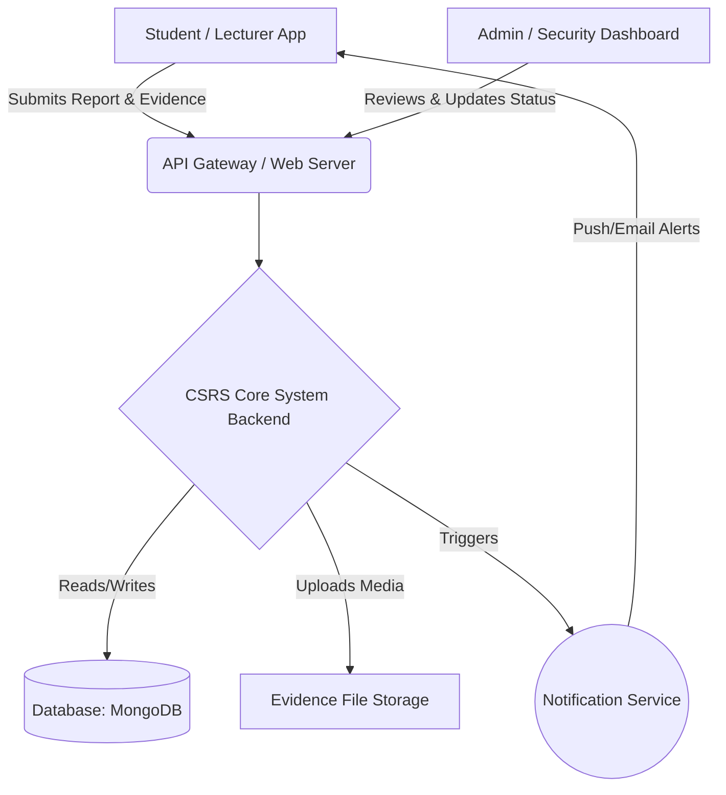
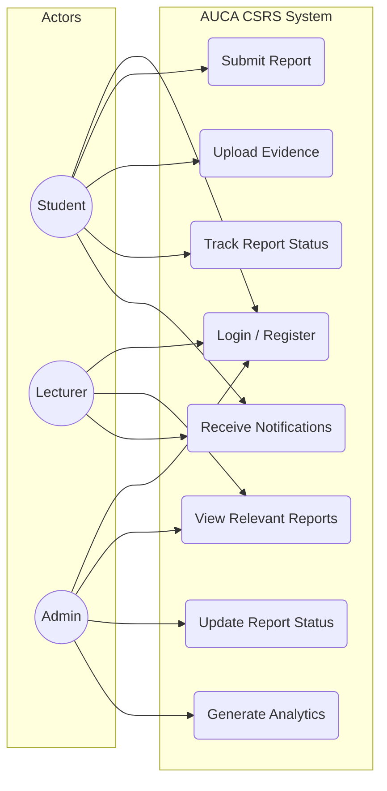
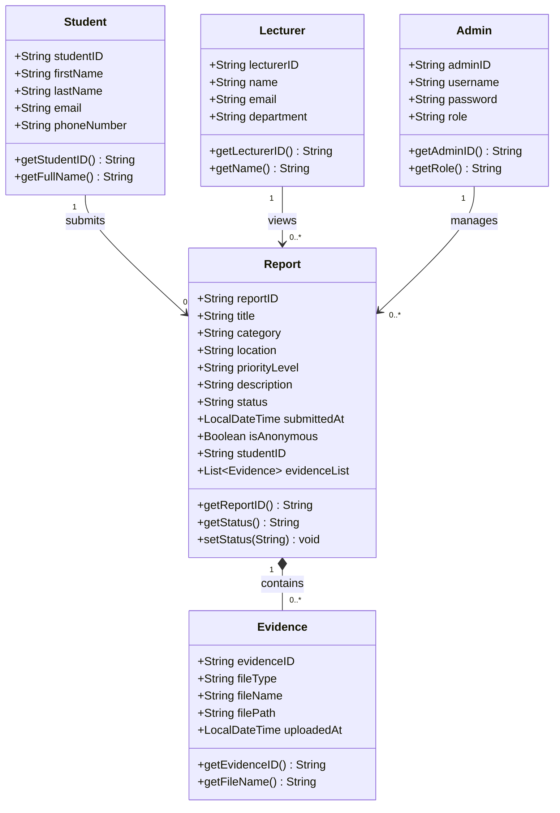
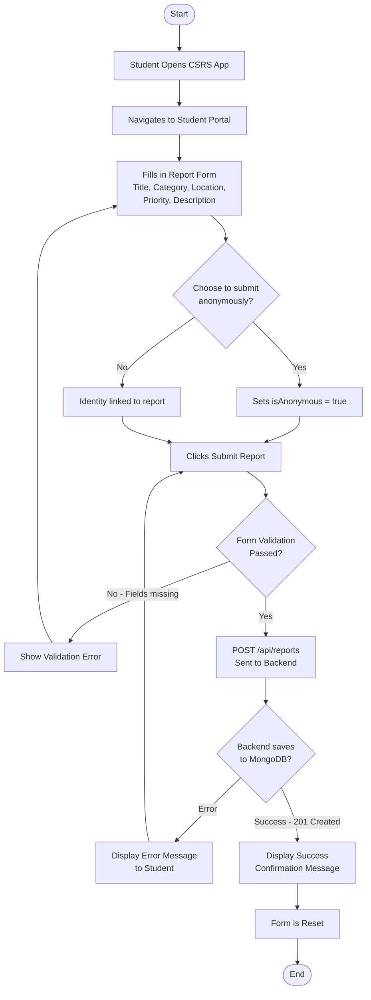
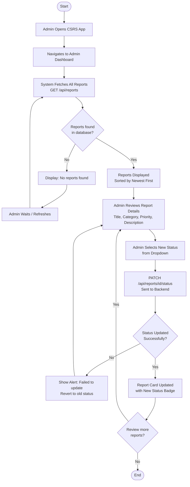
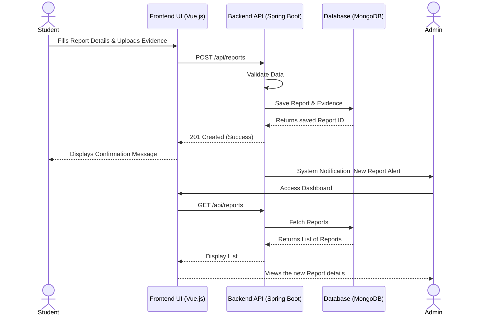
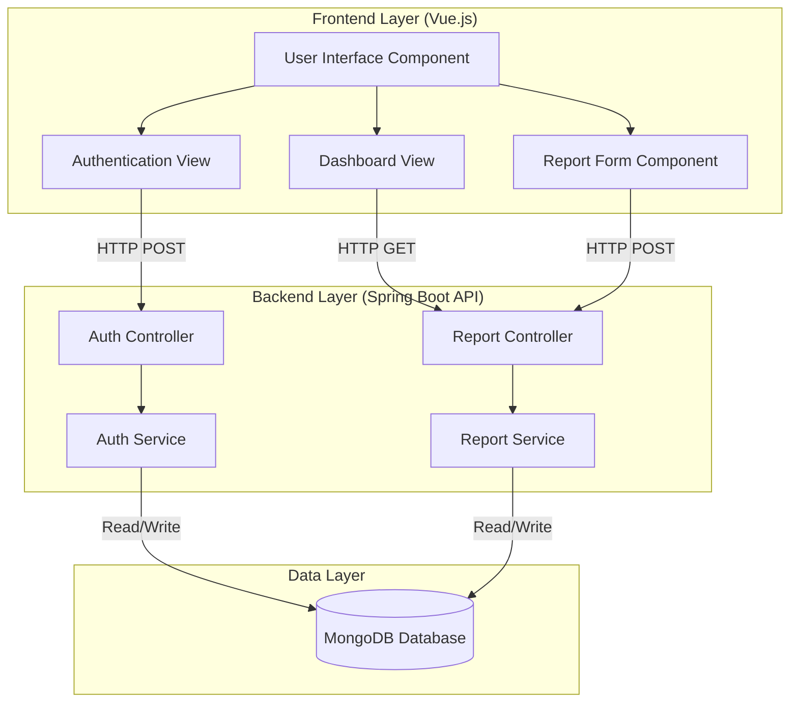

# PHASE 1: System Analysis and Design

**Topic:** AUCA-Campus Security And Reporting System (CSRS)
**Case Study:** Adventist University of Central Africa (AUCA)

---

### i. General Description and Analysis of the Chosen Case Study
**Adventist University of Central Africa (AUCA)** is a prominent higher education institution. Like any large campus with a high volume of students, faculty, and administrative staff moving daily across its premises, maintaining a safe and secure environment is a top priority. The campus includes lecture halls, administrative blocks, student centers, and extensive outdoor areas. 

Currently, security management relies heavily on manual patrols, physical security guards stationed at key points, and traditional reporting methods such as phone calls or physical visits to the security office. While functional, this traditional approach lacks a centralized, real-time digital mechanism for the university community to seamlessly interact with the security department.

### ii. Functional Diagram
This diagram illustrates the internal workings and data flow of the proposed CSRS within the AUCA environment.

### iii. Problem Faced by AUCA
Despite having a dedicated security team, AUCA faces several critical challenges with its current manual reporting system:
1. **Delayed Incident Reporting & Response:** Students and staff must physically locate a guard or call an office to report an issue, leading to dangerous delays during critical incidents.
2. **Lack of Anonymity:** Fear of retaliation or exposure often discourages students from reporting suspicious activities, vandalism, or bullying.
3. **Loss of Critical Evidence:** In a manual system, physical evidence (like a photo or video taken on a phone) is difficult to formally attach to an incident report and is often lost or mishandled.
4. **No Centralized Tracking & Analytics:** The administration has no automated way to track the status of reported incidents in real-time, nor can they easily generate analytical reports to identify "hotspots" or recurring security threats on campus.

---

### iv. Object-Oriented System Analysis and Design Diagrams

#### 1. Use Case Diagram
This diagram maps out exactly what actions each user can perform within the system.

#### 2. Class Diagram
This diagram models all entities in the CSRS system and their relationships, based on the implemented Java models.

#### 3. Activity Diagrams

**Activity Diagram 1 — Student Submits a Security Report**

This diagram shows the step-by-step flow of actions when a student submits an incident report through the system.

---

**Activity Diagram 2 — Admin Reviews and Updates a Report**

This diagram shows the flow of actions when an Admin logs into the dashboard and manages incoming reports.

#### 4. Sequence Diagram
This diagram shows the chronological, step-by-step interaction of objects when a Student submits a new security report.

#### 5. Component Diagram
This diagram outlines the physical and logical software components of the CSRS application.

